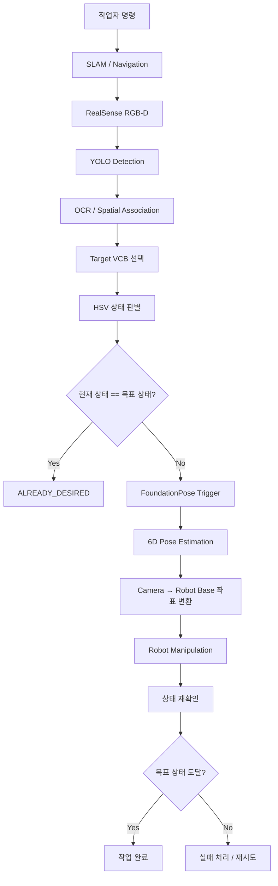

# ROS2 Humble 개발 현황 및 향후 계획

## 1. Branch 목적

`ros2-humble` 브랜치는 기존 ROS1 기반 VCB 상태 인식 및 FoundationPose 시스템을
ROS2 Humble 기반으로 확장하고, 향후 SLAM / Navigation / Robot Manipulation과
연동하기 위한 개발 브랜치이다.

**최종 목표 흐름:**


## 2. 현재 반영 완료

### 2.1 ROS2 확장

기존 ROS1 코드를 유지하면서 ROS2 대응 코드 추가

**주요 반영 내용:**

- `rclpy` 기반 ROS2 통신
- RealSense RGB / Depth / CameraInfo 입력
- YOLO ROS2 image topic 입력
- FoundationPose ROS2 결과 publish

**주요 파일**
- camera/pose_estimator_ros2.py
- camera/pose_streamer_ros2.py
- camera/pose_debugger_ros2.py
- yolo/src/main_infer_ros2.py

### 2.2 Camera Rotation 보정

카메라 raw image가 반시계 방향 90도 회전되어 입력되는 문제 대응

**주요 반영 내용:**

- 입력 회전 옵션 `none`, `90_cw` 지원
- RGB / Depth / Camera intrinsic K를 동일한 기준으로 회전 보정
- 회전 보정된 데이터를 기준으로 YOLO / OCR / HSV / FoundationPose 수행

**주요 파일:**

- `rotation_utils.py`

**기타:**

- RGB-D 기반 Pose Estimation 시 RGB, Depth, Camera intrinsic 간 좌표 일관성 유지

### 2.3 Multi-VCB Detection 및 Spatial Association

복수 VCB 환경을 지원하도록 단일 객체 처리 구조를 다중 객체 처리 구조로 확장

**주요 반영 내용:**

- 모든 `vcb`, `label`, `status` bbox 유지
- 각 label bbox에 대해 독립적으로 OCR 수행
- label / status와 VCB 간 spatial association
- VCB별 perception instance 구성
- association되지 않은 detection 별도 관리

**주요 파일:**

- `yolo/src/main_infer_ros2_semantic_fp.py`

### 2.4 Operator Command 기반 Target VCB 선택

작업자가 명령을 기반으로 실제 작업 대상 VCB를 선택하는 구조 추가

**주요 반영 내용:**

- `command_id`, `target_label`, `desired_state`, `active` 기반 명령 관리
- OCR 결과와 `target_label` 비교
- 작업 대상 VCB 선택
- target 미검출 및 중복 검출 예외 처리

**주요 파일:**

- `operator_command.py`
- `yolo/src/main_infer_ros2_semantic_fp.py`

**기타:**

- ROS2 topic: `/vcb/operator_command`
- 동일 label이 복수 VCB에서 검출되는 경우 자동 선택하지 않음

### 2.5 Target VCB 상태 판별

선택된 target VCB에 대해서만 현재 OPEN / CLOSE 상태를 판별하도록 구성

**주요 반영 내용:**

- target VCB에 association된 status에 대해서만 HSV 분석
- Green → `OPEN`
- Red → `CLOSE`
- 현재 상태와 목표 상태 비교
- 동일 상태 → `ALREADY_DESIRED`
- 다른 상태 → `ACTION_REQUIRED`

**주요 파일:**

- `yolo/src/main_infer_ros2_semantic_fp.py`
- `yolo/src/hsv_val_data.py`

### 2.6 FoundationPose Semantic Trigger

Perception 결과와 작업자 명령을 기반으로 필요한 경우에만 FoundationPose를 실행하도록 구성

**주요 반영 내용:**

- `ACTION_REQUIRED` 상태에서만 FoundationPose trigger 후보 생성
- 동일 조건 3 frame 연속 확인
- 동일 command에 대한 중복 요청 방지
- one-shot trigger 적용
- ROS2 기반 FoundationPose request / result 연동

**주요 파일:**

- `yolo/src/main_infer_ros2_semantic_fp.py`
- `camera/pose_trigger_ros2.py`

**기타:**

```text
Target VCB 확인
        ↓
현재 상태 확인
        ↓
ACTION_REQUIRED
        ↓
3 frame 연속 동일 조건 확인
        ↓
FoundationPose Request
```

### 2.7 FoundationPose Retry

FoundationPose에서 target object를 찾지 못한 경우 자동 재시도 기능 추가

**주요 반영 내용**
- 최초 요청 포함 최대 3회 실행
- 실패 후 일정 시간 대기 후 재시도
- retry 전 최신 perception 결과 확인
- 동일 command / target / desired state 여부 확인
- 현재도 ACTION_REQUIRED인 경우에만 재시도
- pose 추정 성공 시 추가 요청 중단

**주요 파일:**
- `yolo/src/main_infer_ros2_semantic_fp.py`

### 2.8 EasyOCR Offline 실행 지원

네트워크가 없는 현장에서도 OCR을 실행할 수 있도록 EasyOCR 모델을 프로젝트 내부에서 관리

**주요 반영 내용**
- 프로젝트 내부 EasyOCR detector / recognizer model 사용
- model_storage_directory를 프로젝트 내부 경로로 지정
- EasyOCR 자동 다운로드 비활성화
- 인터넷 연결 없이 OCR 실행 가능

**주요 파일**
- yolo/src/easyocr_val_data_rule.py
- yolo/weights/easyocr/craft_mlt_25k.pth
- yolo/weights/easyocr/english_g2.pth

**기타**
```text
yolo/weights/easyocr/
├── craft_mlt_25k.pth
└── english_g2.pth
```

## 3. 향후 시스템 구조

최종적으로 작업자 명령부터 VCB 조작 및 상태 재확인까지
다음과 같은 ROS2 기반 시스템 구조로 통합하는 것을 목표로 한다.



## 4. TODO

### 4.1 SLAM / Navigation 연동

- 작업자 명령에 따른 목표 VCB 위치 선정
- SLAM map 기반 VCB 위치 관리
- Navigation을 이용한 VCB 작업 위치 이동
- 작업 가능한 카메라 / 로봇 위치 및 자세 정의


### 4.2 Camera → Robot Base 좌표 변환

- FoundationPose 결과의 camera frame pose를 robot base frame으로 변환
- Camera extrinsic calibration
- ROS2 TF 기반 좌표계 관리
- 실제 로봇 기준 VCB 6D pose 검증


### 4.3 Robot Manipulation 연동

- Target VCB 6D pose 기반 manipulation target 생성
- OPEN / CLOSE 동작에 따른 manipulation sequence 정의
- 접근 / 조작 / 후퇴 동작 구현
- 충돌 및 조작 실패에 대한 안전 처리


### 4.4 작업 후 상태 재확인

- Manipulation 완료 후 YOLO / OCR / HSV 재실행
- Target VCB 현재 상태 재확인
- 목표 상태 도달 여부 판정
- 실패 시 재시도 또는 작업 중단 정책 정의


### 4.5 전체 시스템 통합 검증

- SLAM / Navigation → Perception → FoundationPose → Manipulation 통합
- 실제 VCB 환경에서 end-to-end 테스트
- 반복 동작 안정성 및 실패 상황 검증
